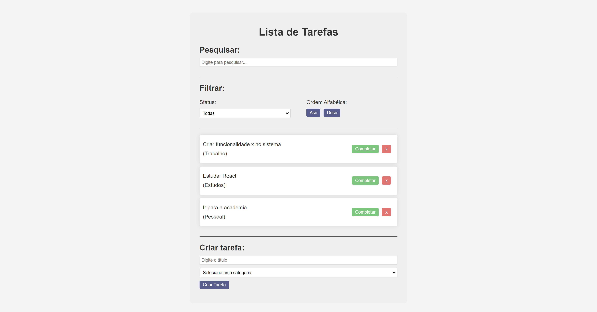

<h1 align="center">Lista de Tarefas</h1>

  <a href="#-tecnologias">Tecnologias</a>&nbsp;&nbsp;&nbsp;|&nbsp;&nbsp;&nbsp;
  <a href="#-projeto">Projeto</a>&nbsp;&nbsp;&nbsp;|&nbsp;&nbsp;&nbsp;
  <a href="#memo-licença">Licença</a>

  

 

  

## 🚀 Tecnologias Utilizadas

Esse projeto foi desenvolvido com as seguintes tecnologias:

- ReactJS: Biblioteca JavaScript para a construção de interfaces de usuário.

## 📑 Estrutura do Projeto

- A estrutura do projeto está organizada da seguinte forma:

- src/components: Componentes React reutilizáveis.

## 💻 Projeto

Este é um projeto ReactJS. O objetivo principal do projeto é implementar uma aplicação de lista de tarefas com a funcionalidade de filtro e busca.

## ⚙️ Funcionalidades

Lista de Tarefas: Permite adicionar, editar e excluir tarefas. As tarefas podem ser marcadas como concluídas.

Filtros e Buscas: Oferece funcionalidades de filtrar tarefas por status (pendente, concluída) e busca por palavras-chave.

## ❣️ Contribuição

Sinta-se à vontade para contribuir com melhorias, correções de bugs ou novas funcionalidades. Abra uma issue para discutir ideias e sugestões, ou envie um pull request.

Esperamos que este projeto seja útil para o gerenciamento eficiente de tarefas, combinando funcionalidades de lista de tarefas, filtros. Se tiver alguma dúvida ou sugestão, não hesite em entrar em contato. Aproveite o desenvolvimento!

## :memo: Licença

Esse projeto está sob a licença MIT.

---

Feito com ♥ by Seu Nome :wave:
